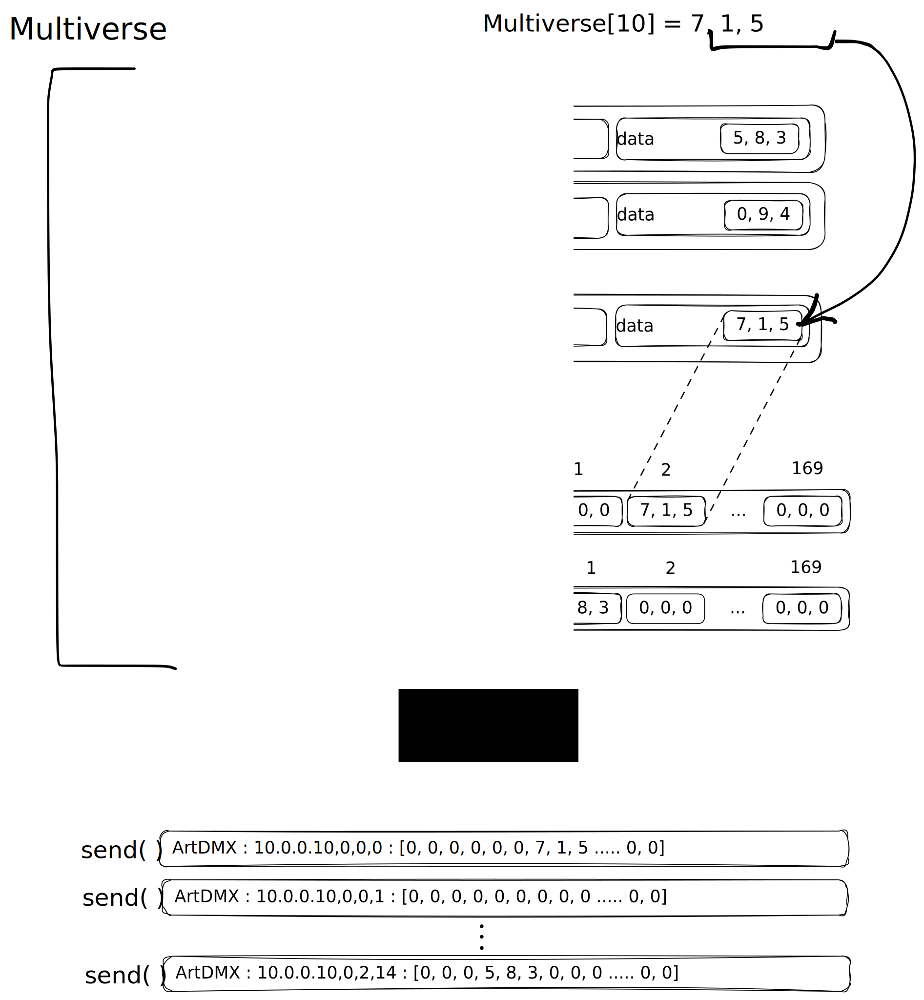

# Multi-controller supervisor library
Модуль для контроля сети H802RA узлов.

Протокол управления - [Art-Net (pdf)](docs/art-net.pdf)

Контроллер - [H802RA (pdf)](docs/H802RA%20instructions%20-%20English.pdf)

Лента - [WS2813 (pdf)](docs/WS2813-Worldsemi.pdf)

## Как это работает
На основе конфига строится экземпляр класса мультивселенная, объединяющего
данные всех вселенных в сети, карту пикселей (словарь по глобальному номеру пикселя и его данным) и 
методы для модификации данных по номеру пикселя и формирования и отправки ArtDMX пакетов.

## Конфигурация
nodes:
  - host: 10.0.0.10
    name: box
    outs:
      0: 0-300  # { output number : global pixel numbers range }
      1: 300-600
#
#  - host: 10.0.0.11
#    name: node-1
#    outs:
#      0: 901, 1001-1010
#      1: 600 - 725
#      3: 725- 800,1015
#
#  - host: 10.0.0.12
#    name: j-50
#    outs:
#      2: 800-850
#
#  - host: 10.0.0.13
#    name: tail
#    outs:
#      1: 1016-1028
#      3: 1062
#      7: 850-900, 910, 911

## Запуск тестов

## Использование
